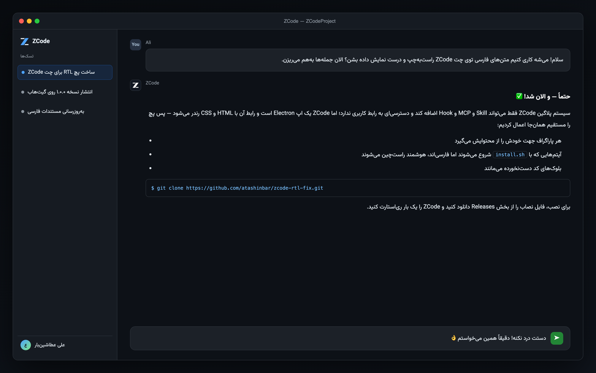
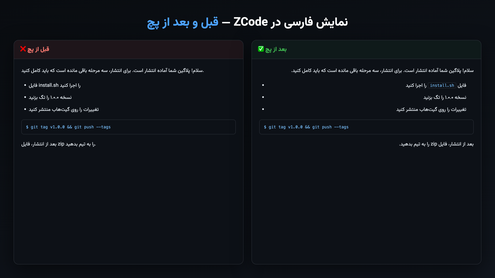

# ZCode RTL Fix

**فارسی** | [English](#english)

نمایش درست متن‌های **فارسی/عربی** به‌صورت راست‌به‌چپ (RTL) در چت [ZCode Desktop](https://z.ai) — بدون اینکه انگلیسی و بلوک‌های کد خراب شوند.



**قبل و بعد از پچ:**



## مشکل

ZCode Desktop جهت پایه‌ی همه‌ی پیام‌ها را LTR فرض می‌کند؛ در نتیجه جمله‌های فارسی به‌هم‌ریخته و از سمت چپ چیده می‌شوند، لیست‌ها چپ‌چین می‌مانند و خواندن واقعاً سخت می‌شود.

## راه‌حل

این پچ یک استایل و یک اسکریپت کوچک به فایل‌های رندرر ZCode (داخل `app.asar`) تزریق می‌کند:

- هر پاراگراف جهتش را از محتوایش می‌گیرد (فارسی → راست‌به‌چپ و تراز از راست، انگلیسی → چپ‌به‌راست)
- آیتم‌های لیست/پاراگراف‌هایی که با کلمه یا کد انگلیسی **شروع** می‌شوند اما عمدتاً فارسی‌اند، هوشمندانه RTL تشخیص داده می‌شوند (شمارش حروف فارسی/لاتین):


- بلوک‌های کد (`pre`/`code`) و چیدمان فلکس/گرید دست‌نخورده می‌مانند
- متن‌های فارسی با **فونت وزیرمتن (Vazirmatn)** نمایش داده می‌شوند — فونت داخل پچ embed شده و نیازی به نصب فونت نیست (انگلیسی با فونت پیش‌فرض سیستم می‌ماند)
- **فیلد تایپ چت دست نمی‌خورد** — ادیتور Lexical جهت را خودش مدیریت می‌کند
- پیام‌های استریم‌شده (موقع تولید) همان لحظه پوشش داده می‌شوند

## نصب

پیش‌نیاز: macOS + نصب بودن [Node.js](https://nodejs.org) + ZCode در `/Applications/ZCode.app`

**روش ۱ — دانلود یک فایل (ساده‌ترین):** از [Releases](https://github.com/atashinbar/zcode-rtl-fix/releases) فایل `ZCode-RTL-Fix-Installer.command` را دانلود کنید و دابل‌کلیک کنید (اگر macOS مانع شد: راست‌کلیک → **Open**).

**روش ۲ — با ترمینال:**

```bash
git clone https://github.com/atashinbar/zcode-rtl-fix.git
cd zcode-rtl-fix
./install.sh
```

بعد از نصب، ZCode را کامل ببندید (**Cmd+Q**) و دوباره باز کنید.

## حذف

```bash
./uninstall.sh
```

نسخه‌ی اصلی `app.asar` در `~/.zcode/rtl-patch/app.asar.backup` نگهداری و برگردانده می‌شود.

## بعد از آپدیت ZCode چه می‌شود؟

آپدیت، کل اپ (شامل پچ) را جایگزین می‌کند — نه اپ خراب می‌شود نه آپدیت شکست می‌خورد؛ فقط `install.sh` را دوباره اجرا کنید. برای اینکه این کار خودکار شود:

```bash
./enable-auto-reapply.sh    # فعال‌سازی نصب خودکار بعد از آپدیت
./disable-auto-reapply.sh   # خاموش‌کردن
```

(یک LaunchAgent می‌سازد که `app.asar` را زیر نظر دارد؛ گزارش در `~/.zcode/rtl-patch/auto-reapply.log`. بعد از آپدیت + پچِ خودکار، یک ری‌استارت ZCode لازم است.)

## سؤالات متداول

- **بعد از نصب اپ بالا نیامد (بعید):** در ترمینال `~/zcode-rtl-patch/uninstall.sh` یا `uninstall.sh` همین ریپو را اجرا کنید.
- **پچ اثر نکرد:** مطمئن شوید ZCode را کامل بسته و باز کرده‌اید (Cmd+Q، نه فقط بستن پنجره).
- **فیلد تایپ جهت عجیبی دارد:** نسخه‌ی آخر پچ نصب است؟ نسخه‌های قدیمی به ادیتور تایپ دست می‌زدند؛ نسخه‌ی جدید عمداً آن را دست نمی‌زند.
- **ویندوز/لینوکس؟** این پچ فقط برای نسخه‌ی macOS است.

## هشدارها

- این یک پچ غیررسمی است و ارتباطی با Z.ai / سازنده‌ی ZCode ندارد.
- پچ `app.asar` را داخل باندل اپ تغییر می‌دهد؛ امضای کد اپ بی‌اعتبار می‌شود (برای اجرا و آپدیت روی همان سیستم مشکلی ایجاد نمی‌کند — مشابه افزونه‌های Custom CSS در VS Code).
- با ZCode 3.11.2 روی macOS (Apple Silicon) تست شده است.

---

<a name="english"></a>

# English

Makes **Persian/Arabic** text render right-to-left correctly in the [ZCode Desktop](https://z.ai) chat — without breaking English text or code blocks. (Full Persian documentation [above](#فارسی).)

## What it does

Injects a small stylesheet + script into ZCode's renderer files (inside `app.asar`):

- Every paragraph picks its direction from its own content (Persian → RTL & right-aligned, English → LTR untouched)
- List items / paragraphs that *start* with a Latin word or inline code but are mostly Persian are smart-detected as RTL (Arabic vs Latin letter counting)
- Code blocks (`pre`/`code`) and flex/grid layouts are never touched
- Persian text renders in the **Vazirmatn** font — embedded in the patch, no font installation needed (English keeps the system default font)
- The chat **composer is deliberately left alone** (Lexical manages its own direction)
- Streaming messages are handled live via a MutationObserver

## Install

Requirements: macOS, [Node.js](https://nodejs.org), ZCode Desktop at `/Applications/ZCode.app`

**Option 1 — one file:** download `ZCode-RTL-Fix-Installer.command` from [Releases](https://github.com/atashinbar/zcode-rtl-fix/releases) and double-click it (if macOS blocks it: right-click → **Open**).

**Option 2 — terminal:**

```bash
git clone https://github.com/atashinbar/zcode-rtl-fix.git
cd zcode-rtl-fix && ./install.sh
```

Then fully restart ZCode (**Cmd+Q** → reopen).

## Uninstall

```bash
./uninstall.sh
```

The original `app.asar` is backed up to `~/.zcode/rtl-patch/app.asar.backup` and restored.

## After a ZCode update

Updates replace the whole app (wiping the patch — nothing breaks). Re-run `install.sh`, or enable the auto-reapply watcher:

```bash
./enable-auto-reapply.sh
```

## Notes / Disclaimer

- Unofficial community patch; not affiliated with Z.ai / ZCode.
- Modifies `app.asar` inside the app bundle; the app's code signature becomes invalid (does not affect running or updating on the same machine — same as VS Code "Custom CSS" extensions).
- Tested with ZCode 3.11.2 on macOS (Apple Silicon). macOS only.
- If the app ever fails to start after patching (unlikely), run `uninstall.sh`.

## License

[MIT](LICENSE)

## Credits

- [Vazirmatn](https://github.com/rastikerdar/vazirmatn) font by Saber Rastikerdar — [SIL OFL 1.1](https://openfontlicense.org/open-font-license-official-text/) (embedded)

